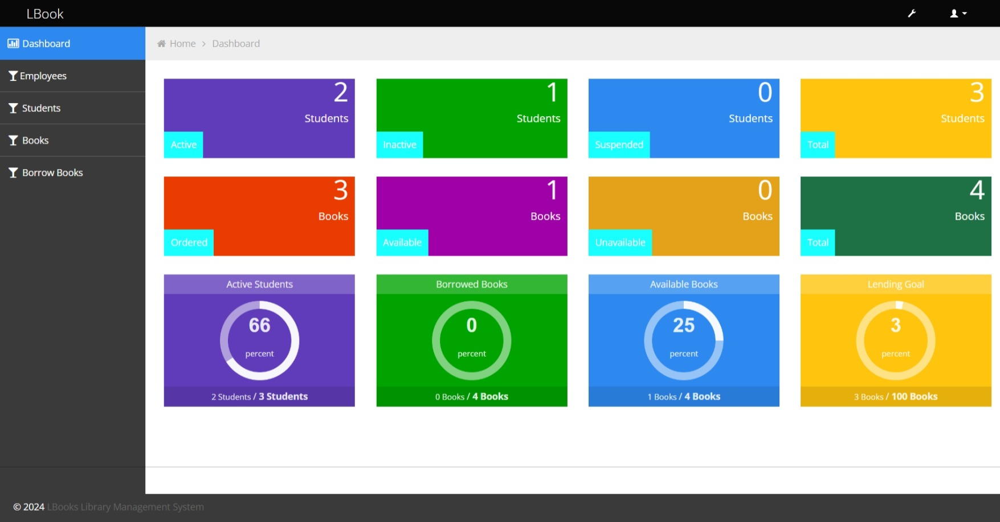
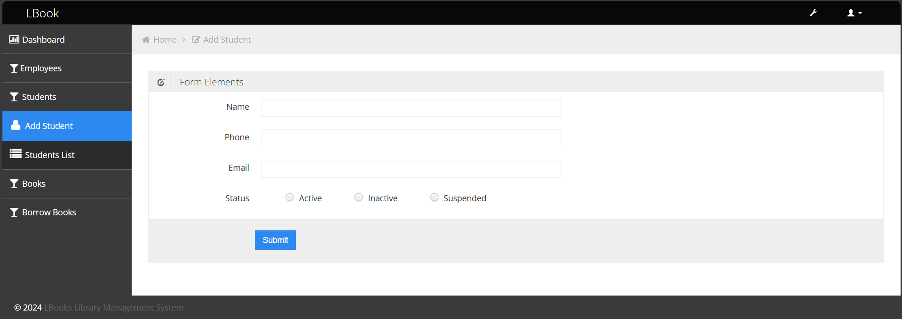
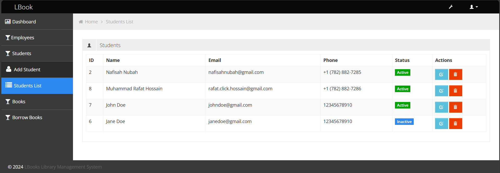

# LBook - Library Inventory Management System 📚

LBook is a fully functional web application designed to simplify and streamline library inventory management. This system enhances operational efficiency by improving book cataloging and user tracking, offering a user-friendly interface for library staff.

## Tech Stack
- **Frontend**: HTML, CSS, JavaScript
- **Backend**: PHP for server-side scripting
- **Database**: MySQL (administered using phpMyAdmin)

## Features
- **Efficient Book Cataloging**: Add, update, and manage books in the inventory with ease.
- **Student Tracking**: Monitor and manage students and their borrowing activities.
- **Employee Authentication**: Requires staff to login/signup prior to use.
- **Informative dashboard**: Dashboard displaying insightful statistics about students and books.
- **Borrow and Return Management**: Track book borrow and return dates efficiently.
- **Responsive Design**: Intuitive, mobile-friendly interface built with modern web technologies.
- **Relational Database**: Ensures fast, reliable data storage and retrieval using MySQL.

## User Interface
- **Dashboard**: Displays insightful statistics about students and books for quick access.
    
- **Navigation Sidebar**: Consists of 4 drop-down options:
  - **Employees**
  - **Students**
  - **Books**
  - **Borrow Books**
  
  Under each drop-down, there are two options:
  - **Add**: Allows you to add new entries.
  - **List**: Displays the entire list of existing entries.

- **Add and View List Pages**: The Add and View List pages for all 4 options (Employees, Students, Books, Borrow Books) are designed similarly, offering a consistent user experience. Below is an example of the "Add" and "List" pages for the **Students** option:
  
  - **Add Students Page**:
    

  - **Students List Page**:
    

- For each option (Employees, Students, Books, Borrow Books), users can edit or delete entries.

## Demonstration
- The app has not been deployed for production yet. However, to give an overview of the user interface and how the system works, here’s a video demonstration: https://youtu.be/XnXuZfTXSEk

## Authors
1. - Name: Nafisah Nubah
   - Email: nafisahnubah@gmail.com

2. - Name: Muhammad Rafat Hossain
   - Email: rafat.click.hossain@gmail.com